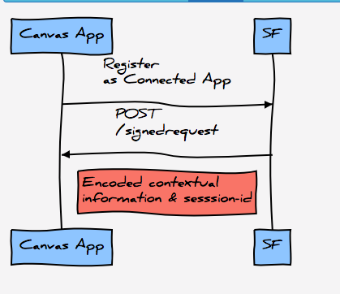
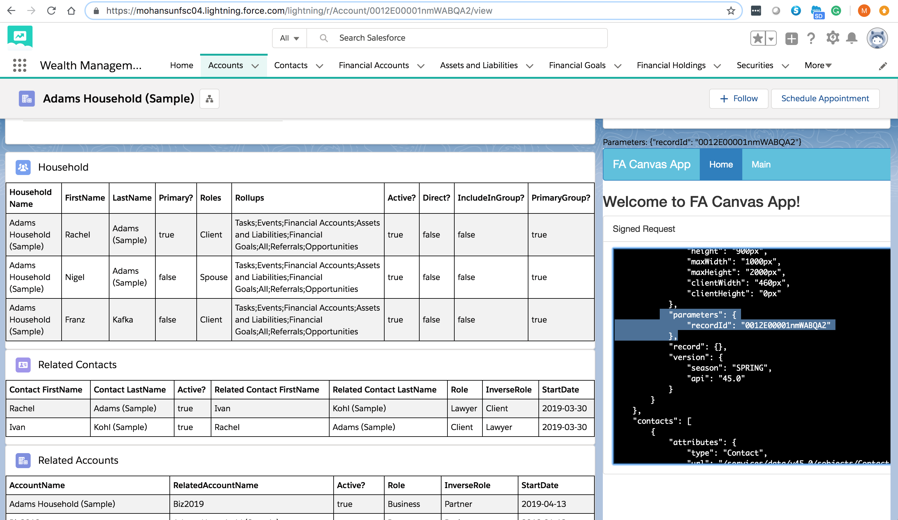

###  How to build Salesforce Canvas App in Node.js at Heroku

### Slides
[SF Heroku Canvas Slides](https://mohan-chinnappan-n2.github.io/2019/canvas/canvas.html)



[UML Sequence Editor](https://mohan-chinnappan-n2.github.io/2019/viz/seq/seq.html)

### Code for the Sequence diagram
``` 
 Canvas App->SF: Register\n as Connected App
 SF->Canvas App:POST\n /signedrequest
 Note left of SF: Encoded contextual \ninformation & sesssion-id

```

### Create a Connected App

[Refer: Christophe's doc](http://ccoenraets.github.io/salesforce-developer-advanced/Using-Canvas.html)

### Doc
[Refer: force:canvasApp doc](https://developer.salesforce.com/docs/component-library/bundle/force:canvasApp/documentation)

<hr/>

#### Step 1: Create a Connected App
```
In Setup, click Build > Create > Apps

In the Connected Apps section, click New, and define the Connected App as follows:

Connected App Name: MyCanvas
API Name: MyCanvas
Contact Email: enter your email address
Enabled OAuth Settings: Checked
Callback URL: http://localhost (you will change this later)
Selected OAuth Scopes: Full Access (full)
Force.com Canvas: Checked
Canvas App URL: http://localhost/signedrequest (you will change this later)
Access Method: Signed Request (POST)
Locations: Layouts and Mobile Cards, Publisher

Click Save

On the Connected App details page, click the Click to reveal link next to Consumer Secret, and copy your secret to your clipboard. You will need it in step 4.

```

#### Step 2: Configure Permissions

```
On the Connected App details page, click the Manage button

Click Edit

    For Permitted Users, select Admin approved users are pre-authorized

    Click Save
---------------------------------------------------------------------------

Click Manage Profiles

    Check System Administrator

    Click Save
```

## How to pass parameters in force:canvasApp component

### Component

```xml
<aura:component implements="force:appHostable,flexipage:availableForAllPageTypes,flexipage:availableForRecordHome,force:hasRecordId" access="global" >
     <aura:handler name="init" value="{!this}" action="{!c.doInit}"/>   
     <aura:attribute name="parameters" type="String" />
      
    Parameters: <ui:outputText value="{!v.parameters}" />
    <force:canvasApp developerName="AccountPositionApp"  parameters="{!v.parameters}"  />

</aura:component>

```

### Controller


```js

({
    doInit : function(cmp) {
        var recordId = cmp.get("v.recordId");
        // Example of writing a URI
        // var params1 = '{"path": "/recordId/' + recordId + '/view"}';
        // Example of recordId parameter
        var params = '{"recordId": "' + recordId + '"}';
        cmp.set("v.parameters", params);
        //alert(params);
    } 
    
    
})

``` 




#### Sample Payload
```js
{
    "instanceUrl": "https://mohansunfsc04.my.salesforce.com",
    "headers": {
        "Authorization": "OAuth 00D2E0000013dPe!dsfsadff.IpGNkJtXBmGdPC894KJ0wtAc8Xl6j91VxSceD.GdPW_.9d3oMelvuObeioYKw8LUJR3Fu"
    },
    "context": {
        "user": {
            "userId": "0052E00000FsXDSQA3",
            "userName": "mohan.chinnappan.abc.com",
            "firstName": "mohan",
            "lastName": "chinnappan",
            "email": "mohan.chinnappan@email.com",
            "fullName": "mohan chinnappan",
            "locale": "en_US",
            "language": "en_US",
            "timeZone": "America/Los_Angeles",
            "profileId": "00e2E000001o2g1",
            "roleId": null,
            "userType": "STANDARD",
            "currencyISOCode": "USD",
            "profilePhotoUrl": "https://mohansunfsc04--c.documentforce.com/profilephoto/005/F",
            "profileThumbnailUrl": "https://mohansunfsc04--c.documentforce.com/profilephoto/005/T",
            "siteUrl": null,
            "siteUrlPrefix": null,
            "networkId": null,
            "accessibilityModeEnabled": false,
            "isDefaultNetwork": true
        },
        "links": {
            "loginUrl": "https://mohansunfsc04.my.salesforce.com",
            "enterpriseUrl": "/services/Soap/c/45.0/00D2E0000013dPe",
            "metadataUrl": "/services/Soap/m/45.0/00D2E0000013dPe",
            "partnerUrl": "/services/Soap/u/45.0/00D2E0000013dPe",
            "restUrl": "/services/data/v45.0/",
            "sobjectUrl": "/services/data/v45.0/sobjects/",
            "searchUrl": "/services/data/v45.0/search/",
            "queryUrl": "/services/data/v45.0/query/",
            "recentItemsUrl": "/services/data/v45.0/recent/",
            "chatterFeedsUrl": "/services/data/v31.0/chatter/feeds",
            "chatterGroupsUrl": "/services/data/v45.0/chatter/groups",
            "chatterUsersUrl": "/services/data/v45.0/chatter/users",
            "chatterFeedItemsUrl": "/services/data/v31.0/chatter/feed-items",
            "userUrl": "/0052E00000FsXDSQA3"
        },
        "application": {
            "name": "AccountPositionApp",
            "canvasUrl": "https://mohansun-fa.herokuapp.com/signedrequest",
            "applicationId": "06P2E000000kG8L",
            "version": "1.0",
            "authType": "SIGNED_REQUEST",
            "referenceId": "09H2E000000kG4l",
            "options": [],
            "samlInitiationMethod": "None",
            "isInstalledPersonalApp": false,
            "developerName": "AccountPositionApp",
            "namespace": ""
        },
        "organization": {
            "organizationId": "00D2E0000013dPeUAI",
            "name": "salesforce",
            "multicurrencyEnabled": false,
            "namespacePrefix": null,
            "currencyIsoCode": "USD"
        },
        "environment": {
            "referer": null,
            "locationUrl": "https://mohansunfsc04.lightning.force.com/lightning/r/Account/0012E00001nmWABQA2/view",
            "displayLocation": "Aura",
            "sublocation": null,
            "uiTheme": "Theme3",
            "dimensions": {
                "width": "800px",
                "height": "900px",
                "maxWidth": "1000px",
                "maxHeight": "2000px",
                "clientWidth": "460px",
                "clientHeight": "0px"
            },
            "parameters": {
                "recordId": "0012E00001nmWABQA2"
            },
            "record": {},
            "version": {
                "season": "SPRING",
                "api": "45.0"
            }
        }
    },
    "contacts": [
        {
            "attributes": {
                "type": "Contact",
                "url": "/services/data/v45.0/sobjects/Contact/0032E00002PUVveQAH"
            },
            "Id": "0032E00002PUVveQAH",
            "FirstName": "Rachel",
            "LastName": "Adams (Sample)",
            "Phone": "(500) 145-0557",
            "Email": "rachel@acmecorp.com"
        },
        {
            "attributes": {
                "type": "Contact",
                "url": "/services/data/v45.0/sobjects/Contact/0032E00002PUVvfQAH"
            },
            "Id": "0032E00002PUVvfQAH",
            "FirstName": "Nigel",
            "LastName": "Adams (Sample)",
            "Phone": null,
            "Email": null
        },
        {
            "attributes": {
                "type": "Contact",
                "url": "/services/data/v45.0/sobjects/Contact/0032E00002PUVvgQAH"
            },
            "Id": "0032E00002PUVvgQAH",
            "FirstName": "Neil",
            "LastName": "Symonds (Sample)",
            "Phone": "5105490092",
            "Email": "neil.symonds@symonds.com"
        },
        {
            "attributes": {
                "type": "Contact",
                "url": "/services/data/v45.0/sobjects/Contact/0032E00002PUVvhQAH"
            },
            "Id": "0032E00002PUVvhQAH",
            "FirstName": "Ivan",
            "LastName": "Kohl (Sample)",
            "Phone": null,
            "Email": "ivan.kohl@skh.com"
        },
        {
            "attributes": {
                "type": "Contact",
                "url": "/services/data/v45.0/sobjects/Contact/0032E00002QdiN6QAJ"
            },
            "Id": "0032E00002QdiN6QAJ",
            "FirstName": "Franz",
            "LastName": "Kafka",
            "Phone": null,
            "Email": null
        }
    ]
}
        
```

### Where is my parameters?
```bash
$ cat views/js/payload.json | jq '.context.environment.parameters'
{
  "recordId": "0012E00001nmWABQA2"
}

```

### Configuring VisualSource to use Canvas App (AccountPositionApp2, POST will be done to /toolbar)
```xml
<apex:page >
  <apex:includeLightning />
  <script type="text/javascript" src="/canvas/sdk/js/45.0/canvas-all.js"></script>
  <script type="text/javascript" src="/canvas/sdk/js/45.0/controller.js"></script>
  <script type="text/javascript">
      // this function will be called as soon as the Canvas App is loaded (onCanvasAppLoad)
      // ref: https://developer.salesforce.com/docs/atlas.en-us.platform_connect.meta/platform_connect/canvas_app_event_subscribe_code_example.htm
      // statusChanged is the name of the custom event we will subscribe to
      // see: app.js and  myevents.ejs 
      //   it has publish for this custom event
      //        Sfdc.canvas.client.publish(signedRequest.client, 
      //          {name : "statusChanged", payload : {parameters : signedRequest.context.parameters}});

      function subscribeToCanvasEvent() {
          Sfdc.canvas.controller.subscribe({name : 'statusChanged', onData : function (payload) {
              var recordId =  payload.parameters.recordId;
              console.log("recordId:" + recordId);
              // ref: https://developer.salesforce.com/docs/atlas.en-us.salesforce1.meta/salesforce1/salesforce1_dev_jsapi_sforce_one.htm
              // format: sforce.one.navigateToSObject(recordId, view)
              // view specifies the slide within record home to display initially.
              // The possible values are .
              //   detail: the record detail slide
              //   chatter: the Chatter slide
              //   related: the view of related slide
              sforce.one.navigateToSObject(recordId,"related");
          }});
      }

 </script>
 <!--
 Doc:
 https://developer.salesforce.com/docs/atlas.en-us.platform_connect.meta/platform_connect/canvas_app_vf_component_ref.htm
 onCanvasAppLoad is
 Name of the JavaScript function to be called after the canvas app loads.

 parameters example: 
 parameters="{!JSENCODE(Account.Id)}"


 -->
  <apex:canvasApp applicationName="AccountPositionApp2" 
    height="1000px" width="800px"
    parameters="{recordId:'001sfddfsdfsdf'}"
    onCanvasAppLoad="subscribeToCanvasEvent()"/>
</apex:page>

```


